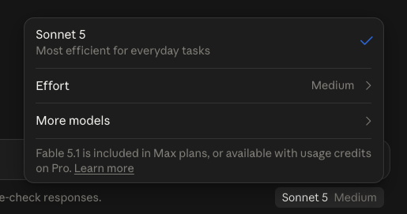

## Choisir son modèle et son effort
type: titre

« Lequel je prends ? »
La question que tout le monde se pose, et à laquelle personne ne répond jamais vraiment.

::: notes
Demander à {{client.prenom}} quel modèle il utilise aujourd'hui, et pourquoi celui-là. La réponse est presque toujours « celui par défaut » ou « le plus gros, au cas où ».

Les deux réponses coûtent cher, pour des raisons opposées. C'est tout le module.
:::

---

## Trois familles, une même logique
type: concept

| | Le plus capable | L'équilibré | Le rapide et économique |
| --- | --- | --- | --- |
| **Anthropic** | Fable 5.1 | Opus 5 · Sonnet 5 | Haiku 4.5 |
| **OpenAI** | GPT-6 Astra | GPT-5.6 Sol | les variantes légères |
| **Google** | Gemini 3.1 Pro | Gemini 3.x Flash | Gemini 3.1 Flash-Lite |

Chaque famille se décline sur **le même axe** : plus capable et plus lent d'un côté, plus rapide et moins cher de l'autre.

Les noms changent tous les trois mois. L'axe, lui, ne bouge pas — c'est lui qu'il faut retenir.

::: notes
Ne pas apprendre les noms par cœur, ils seront périmés à la prochaine session. Faire retenir la structure en trois tiers : elle est stable depuis deux ans chez les trois.

Si le participant demande « lequel est le meilleur » : sur un classement générique, ça se joue à quelques points et ça change tous les mois. Sur *son* cas à lui, l'écart entre un bon prompt et un mauvais prompt est plus grand que l'écart entre les trois familles.
:::

---

## Le vrai réglage : combien il réfléchit
type: concept

Depuis 2026, les trois fournisseurs exposent le même curseur — la **profondeur de raisonnement** avant de répondre.

| Fournisseur | Le réglage | Ses crans |
| --- | --- | --- |
| Anthropic | `effort` | low · medium · **high** (défaut) · xhigh · max |
| OpenAI | `reasoning_effort` | low · medium · high |
| Google | `thinking_level` | MINIMAL · LOW · MEDIUM · HIGH |

Le modèle décide lui-même combien réfléchir, en croisant **deux choses** : le cran que vous avez mis, et la difficulté qu'il perçoit dans votre demande.

Sur une question simple, même réglé haut, il répond directement.

::: notes
C'est le concept le plus mal compris du marché, et le plus rentable de la journée.

Insister : le curseur n'est pas un interrupteur « intelligent / bête ». C'est un budget de réflexion. Le modèle reste le même.
:::

---

## Ce que le curseur change vraiment
type: concept

```svg
<svg viewBox="0 0 700 150" xmlns="http://www.w3.org/2000/svg" style="width:100%;height:auto">
  <g font-family="inherit" font-size="12.5" fill="currentColor">
    <line x1="60" y1="34" x2="640" y2="34" stroke="currentColor" stroke-width="1.5" opacity="0.35"/>
    <circle cx="60" cy="34" r="4" fill="currentColor"/><circle cx="205" cy="34" r="4" fill="currentColor"/>
    <circle cx="350" cy="34" r="6" fill="currentColor"/><circle cx="495" cy="34" r="4" fill="currentColor"/>
    <circle cx="640" cy="34" r="4" fill="currentColor"/>
    <text x="60" y="20" text-anchor="middle" opacity="0.75">low</text>
    <text x="205" y="20" text-anchor="middle" opacity="0.75">medium</text>
    <text x="350" y="20" text-anchor="middle" font-weight="600">high</text>
    <text x="495" y="20" text-anchor="middle" opacity="0.75">xhigh</text>
    <text x="640" y="20" text-anchor="middle" opacity="0.75">max</text>
    <text x="350" y="62" text-anchor="middle" font-size="10.5" opacity="0.6">défaut</text>
    <text x="60" y="96" opacity="0.9">Rapide · peu cher</text>
    <text x="60" y="116" opacity="0.6">Répond vite, explore peu,</text>
    <text x="60" y="132" opacity="0.6">suit les consignes au pied de la lettre</text>
    <text x="640" y="96" text-anchor="end" opacity="0.9">Lent · cher</text>
    <text x="640" y="116" text-anchor="end" opacity="0.6">Explore, vérifie, revient en arrière,</text>
    <text x="640" y="132" text-anchor="end" opacity="0.6">creuse les cas limites</text>
  </g>
</svg>
```

En montant le curseur, vous n'achetez pas de l'intelligence. Vous achetez de **l'exploration** : plus d'hypothèses testées, plus de vérifications, plus de retours en arrière.

::: notes
Analogie qui marche bien : c'est la différence entre répondre du tac au tac en réunion et prendre la nuit pour y réfléchir. Même personne, même compétence. Ce qui change, c'est le temps de délibération.

Corollaire à faire dire par le participant : sur une question dont la réponse est évidente, la nuit de réflexion n'apporte rien.
:::

---

## Quand monter, quand descendre
type: concept

| Type de tâche | Cran | Pourquoi |
| --- | --- | --- |
| Reformuler, résumer, classer, trier | **bas** | Une seule bonne réponse, pas d'arbitrage |
| Rédiger à partir de matière fournie | **bas à moyen** | La difficulté est dans le contexte, pas le raisonnement |
| Analyser en croisant plusieurs sources | **haut** | Il faut arbitrer entre des données qui se contredisent |
| Concevoir, planifier, structurer un dossier | **haut** | Beaucoup de chemins possibles, il faut en comparer |
| Traiter du volume, en boucle, sans surveillance | **haut** | Une erreur non détectée se propage sur tout le lot |

La règle : **le curseur suit le nombre de décisions à prendre**, pas la longueur du texte à produire.

::: notes
La dernière ligne est la clé. Les gens montent le curseur parce que le document est long, alors que ce qui compte c'est le nombre d'arbitrages.

Rédiger vingt pages à partir d'un plan fourni : peu de décisions, curseur bas. Choisir entre trois stratégies commerciales sur une page : beaucoup de décisions, curseur haut.
:::

---

## Le piège du « toujours le plus gros »
type: piege

Le réflexe naturel : prendre le modèle le plus capable, au cran maximum, pour tout.

Trois coûts, dont deux invisibles :

- **L'argent** — sur les tarifs professionnels, l'écart entre le tier économique et le tier haut est d'un facteur cinq à dix pour le même texte.
- **Le temps** — une réponse qui prend deux minutes au lieu de cinq secondes, vingt fois par jour, vous sort du flux de travail.
- **La sur-analyse** — c'est le plus contre-intuitif. Sur une tâche simple, un modèle réglé trop haut explore des pistes qui n'existent pas, ajoute des nuances qu'on ne lui demande pas, et rend un résultat plus long et moins utilisable.

> Un raisonnement profond sur une question triviale, c'est une réunion de trois heures pour choisir un fournisseur de café.

::: notes
La sur-analyse est le point à faire vivre en direct : lancer la même demande simple à deux crans différents et faire constater que le résultat « haut » est plus long, plus prudent, moins tranchant.

C'est aussi ce qui explique la sensation « il était mieux avant » chez des gens passés à un modèle plus récent sans toucher au réglage.
:::

---

## La méthode : descendre, pas monter
type: concept

La plupart des gens partent en bas et montent quand ils sont déçus. Faites l'inverse.

1. Démarrez un cran **au-dessus** de ce que vous pensez nécessaire.
2. Obtenez un résultat qui vous satisfait. C'est votre référence.
3. Redescendez d'un cran. Comparez sur le **même** cas.
4. Si la qualité tient, restez en bas et gardez la différence.
5. Recommencez jusqu'à ce que ça casse. Remontez d'un cran.

Vous obtenez le réglage le moins cher qui fait le travail, et vous savez **pourquoi** c'est celui-là.

::: notes
Cette méthode a un nom en ingénierie : partir du connu-bon vers l'économique, jamais l'inverse. En partant du bas, on ne sait jamais si le résultat médiocre vient du réglage ou du prompt.

À faire faire en atelier sur un cas réel, sinon ça reste théorique.
:::

---

## Un fait qui change la donne
type: concept

Une génération de modèles à **cran bas** égale souvent la génération précédente à **cran haut**.

Deux conséquences pratiques :

- Passer au modèle plus récent permet en général de **descendre** le curseur, pas de le monter.
- Empiler deux modèles différents pour économiser (un petit qui trie, un gros qui traite) vaut rarement le coup avant d'avoir essayé le modèle récent réglé bas.

::: notes
Point rarement dit et très rentable. Beaucoup d'entreprises construisent des architectures à deux modèles pour économiser, alors que le modèle récent au cran bas fait le travail pour moins cher et sans complexité.

Règle de gestion : mesurer le coût **par tâche terminée**, pas par requête. Une requête moins chère qui demande trois relances n'est pas moins chère.
:::

---

## Où est ce réglage, concrètement
type: concept

**Dans l'application grand public** — un menu pour le modèle, et juste dessous un réglage d'effort. Trois niveaux ici, réglé sur « moyen » par défaut.



**Dans l'API et les outils de développement** — les cinq crans, requête par requête.

**Dans une tâche planifiée** — c'est là que ça compte le plus : elle tourne cent fois sans vous. Un cran de trop, multiplié par cent, se voit sur la facture ; un cran de moins sur une tâche à arbitrages produit cent résultats médiocres que personne ne relit.

::: notes
Adapter selon l'accès du participant. Pour {{client.prenom}}, l'essentiel se joue dans l'app : le choix du modèle et le réglage d'effort, tous deux dans le même menu.

Faire ouvrir le menu en direct sur sa machine. Montrer que « moyen » est le défaut, et qu'on peut descendre à « faible » pour les tâches simples.

Le point sur les tâches planifiées prépare le module 10. Y revenir explicitement à ce moment-là.
:::

---

## Classer ses propres tâches
type: atelier
livrable: Votre liste de tâches récurrentes, chacune avec un modèle et un cran, et une comparaison faite sur un cas réel

1. Listez six tâches que vous confiez régulièrement à l'IA.
2. Pour chacune, comptez le nombre de **décisions** qu'elle exige. Pas sa longueur.
3. Placez-la sur le curseur d'après ce compte.
4. Prenez celle qui vous coûte le plus de temps. Lancez-la deux crans au-dessus, puis un cran en dessous.
5. Comparez les deux résultats côte à côte. Notez si l'écart justifie l'écart de temps.

::: notes
L'étape 5 est celle qui convainc. Dans la majorité des cas sur des tâches commerciales courantes, l'écart de qualité est faible et l'écart de temps est net — c'est ce constat, fait par le participant lui-même, qui installe la méthode.

Prendre {{client.cas}} si le participant sèche.
:::

---

## À retenir
type: recap

- Trois familles, trois tiers chacune. Les noms changent, l'axe capable/rapide reste.
- Le réglage qui compte est la profondeur de raisonnement, pas seulement le modèle.
- Le curseur suit le nombre de décisions à prendre, pas la longueur du texte à produire.
- Trop haut coûte de l'argent, du temps, et produit de la sur-analyse.
- Méthode : partir au-dessus, redescendre jusqu'à ce que ça casse, remonter d'un cran.
- Un modèle récent réglé bas vaut souvent l'ancien réglé haut.

::: notes
Enchaîner sur les coûts : « avant d'apprendre à s'en servir, autant savoir ce que ça coûte — la question revient toujours. »
:::
